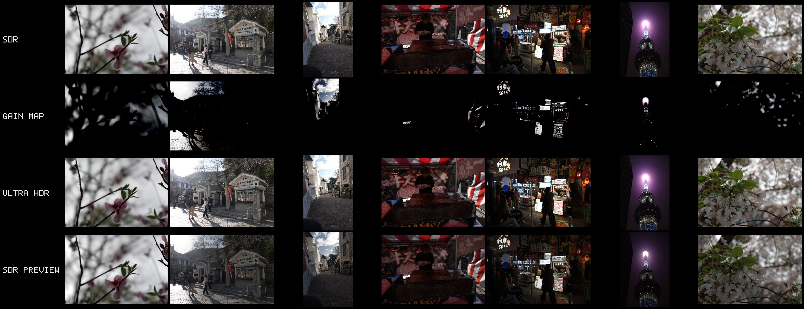

# arw2uhdr

Convert Sony **ARW + JPEG** pairs into **Ultra HDR** (JPEG_R) images. The camera JPEG stays
byte-for-byte as the SDR base, the RAW drives highlight recovery, and a gain map makes highlights
pop on HDR displays — while SDR screens still show the original JPEG, unchanged.

Built for and validated on the Sony RX100M7, and designed to extend to other Sony bodies.



*Seven frames through the pipeline, one per column. Top to bottom: the camera JPEG, the gain map,
the Ultra HDR result, and an SDR preview of it for non-HDR screens. The figure is itself a single
Ultra HDR JPEG — see [`tools/showcase`](tools/showcase).*

## How it works

The conversion runs as four stages:

1. **RAW decode** — LibRaw (cgo) to scene-linear, decoded sensor-native so it stays aligned with
   the stored JPEG's orientation.
2. **Lens correction** — applies Sony's embedded distortion/CA profile (parsed from the ARW in pure
   Go) and registers the RAW onto the JPEG grid so the two align pixel-for-pixel.
3. **HDR rendition** — the default `raw` mode takes the boost from how much brighter the RAW is than
   the JPEG, gated by JPEG luma so highlights lift while shadows stay put. `highlight` (synthetic
   boost) and `develop` modes are also available.
4. **Gain map + container** — builds a single- or per-channel gain map with the Adobe/Google `hdrgm`
   math and assembles the JPEG_R container, all in pure Go.

Each stage is a Go interface with a default implementation, so any can be swapped — see
[Extending](#extending-the-pipeline).

## Build

Requires Go ≥ 1.24 and LibRaw headers (`apt install libraw-dev` / `brew install libraw`).

```
make            # builds bin/arw2uhdr
make tools      # builds the dev/debug tools under tools/
make test       # unit tests (sample-based tests skip if samples are absent)
make check      # gofmt + vet + test
```

## Usage

```
arw2uhdr convert [flags] <input.arw> [input.jpg]   convert a pair (default command)
arw2uhdr batch   [flags] <dir|file>...             convert every paired ARW under paths
arw2uhdr verify  <file.jpg>                         check a file's Ultra HDR structure
arw2uhdr inspect <file.arw>                         print the embedded Sony lens profile
arw2uhdr version
```

`convert` is the default command, so `arw2uhdr photo.arw` works too; the JPEG is inferred from the
ARW basename if omitted.

```
arw2uhdr convert photo.ARW                    # pairs with photo.JPG automatically
arw2uhdr convert --gainmap rgb photo.ARW      # per-channel gain map (coloured lights stay saturated)
arw2uhdr convert --strength 1.5 photo.ARW     # push the RAW-driven lift harder
arw2uhdr convert --gainmap-scale 4 photo.ARW  # coarser gain map, smaller file
arw2uhdr convert --verify --json photo.ARW    # machine-readable result + structural self-check
arw2uhdr batch -j 2 -o out/ ~/Photos          # parallel batch
```

Key `convert` / `batch` flags:

| flag | default | meaning |
|---|---|---|
| `--hdr-mode` | raw | `raw` (RAW-driven, JPEG-gated), `highlight` (synthetic boost), or `develop` |
| `--strength` | 1.0 | multiplier on the RAW gain (raw mode); stops of boost (highlight mode) |
| `--threshold` | 0.5 | JPEG-luma gate below which nothing is boosted |
| `--ramp-width` | 0.35 | luma span over which the gate opens fully |
| `--max-boost` | 3.0 | total-boost ceiling in stops |
| `--chroma` | 0.3 | RGB gain saturation, 0..1 (0 = neutral, 1 = full per-channel colour) |
| `--chroma-track` | off | ramp `--chroma` with JPEG brightness (neutral midtones, full colour in highlights) |
| `--gainmap` | rgb | `rgb` (per-channel colour) or `single` (luminance) |
| `--gainmap-scale` | 1 | gain-map downsample factor (raise for smaller files) |
| `--lens` | distortion+ca | `distortion+ca`, `distortion`, or `off` |
| `--vignetting` | off | experimental brightness correction (unvalidated) |
| `--no-register` | — | skip residual registration (debug) |

Exit codes: `0` ok · `2` usage · `3` input · `4` raw decode · `5` lens metadata · `6` render ·
`7` encode · `8` write.

`batch` uses ~1.5 GB RAM per job at 20 MP (scale `-j` accordingly) and runs ~10 s per image on a
modern multi-core machine. `scripts/batch.sh` is a POSIX-shell equivalent.

## Library

```go
import "github.com/invis/arw2uhdr"

res, err := arw2uhdr.Convert(ctx, arw2uhdr.Input{
    ARW:    "photo.ARW",
    JPEG:   "photo.JPG",
    Output: "photo_uhdr.jpg",
}, arw2uhdr.DefaultOptions())
```

`Convert` is a one-shot convenience over `New(opts).Convert(ctx, in)`. The context is honoured at
every stage boundary, so long batches cancel promptly.

### Extending the pipeline

`New` wires four swappable stages onto a `Converter`. Replace any of them to plug in custom
behaviour — e.g. a different raw handler, or an alternative Ultra HDR generator (libultrahdr,
ISO 21496-1):

```go
type RawDecoder interface {
    Decode(ctx context.Context, arwPath string) (*Image, *RawMeta, error)
}
type LensCorrector interface {
    Correct(ctx context.Context, img *Image, arwPath string) (*Image, error)
}
type HDRRenderer interface {
    Render(ctx context.Context, sdrLinear, rawLinear *Image) (*Image, error)
}
type UltraHDREncoder interface {
    Encode(ctx context.Context, baseJPEG []byte, sdrLinear, hdrLinear *Image) (EncodeResult, error)
}

conv := arw2uhdr.New(opts)
conv.Encoder = myLibUltraHDREncoder{}   // keep the rest of the pipeline
res, err := conv.Convert(ctx, in)
```

The default implementations are exported constructors (`NewLibRawDecoder`, `NewEmbeddedLensCorrector`,
`NewHighlightRenderer`, `NewGoEncoder`), so a custom stage can wrap and delegate to them.

## Repository layout

```
.                    library API: Converter, stages, Options, errors
cmd/arw2uhdr         the CLI (thin dispatcher over internal/cli)
internal/
  cli                command implementations
  raw                LibRaw cgo decode
  sonylens           ARW lens-metadata parse + geometric/photometric warp
  register           residual affine registration
  hdrbuild           HDR-linear rendition
  gainmap            gain-map compute / reconstruct
  ultrahdr           JPEG_R container writer + verify
  imaging            float32 RGB image, parallel loops, box blur
  color              sRGB transfer functions
  xmath              shared numeric helpers
tools/               dev/debug commands (showcase, warptest, gmtest, …)
docs/                research notes and design
```

## Notes & limitations

- Needs the full-resolution camera JPEG (shoot RAW+JPEG); the small preview embedded in the ARW is
  too low-res to serve as the SDR base.
- Output is Ultra HDR v1 (`hdrgm` XMP + MPF), read by Android 14+, Chrome, Google Photos, and most
  gain-map-aware viewers. ISO 21496-1 is a possible future addition.
- Lens correction is verified on the RX100M7; other bodies should work through the same parser but
  are untested. Vignetting correction is parsed but off by default (its scale isn't validated yet).
- EXIF orientation (portrait shots) is preserved end-to-end.

## CI

`ci/github-actions-ci.yml` runs gofmt / vet / `test -race` / build with LibRaw installed. Move it to
`.github/workflows/ci.yml` to activate.
